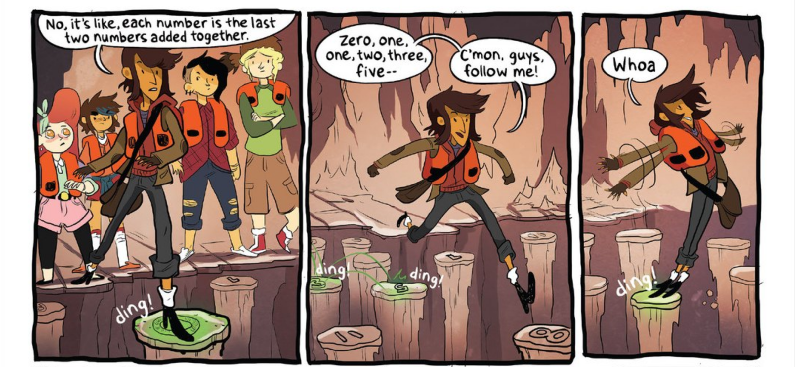

# Random cool stuff

## Issue 3

#### Page 18 - Fibonacci floor tiles

In the weird tunnel the Lumberjanes find a room with seemingly random numbers on the floor.
Jo notices that the Fibonacci sequence can be found on the floor and that it offers safe passage across the room.

Starting at 0 they hop across the room to tile 233 which is F[13], the fourteenth number in the Fibonacci sequence (starting from 0).  This means it took 15 hops to cross the room.. One to hop onto the 0 tile, the thirteen hops in the sequence and the final hop from 233 to the other side of the room.

