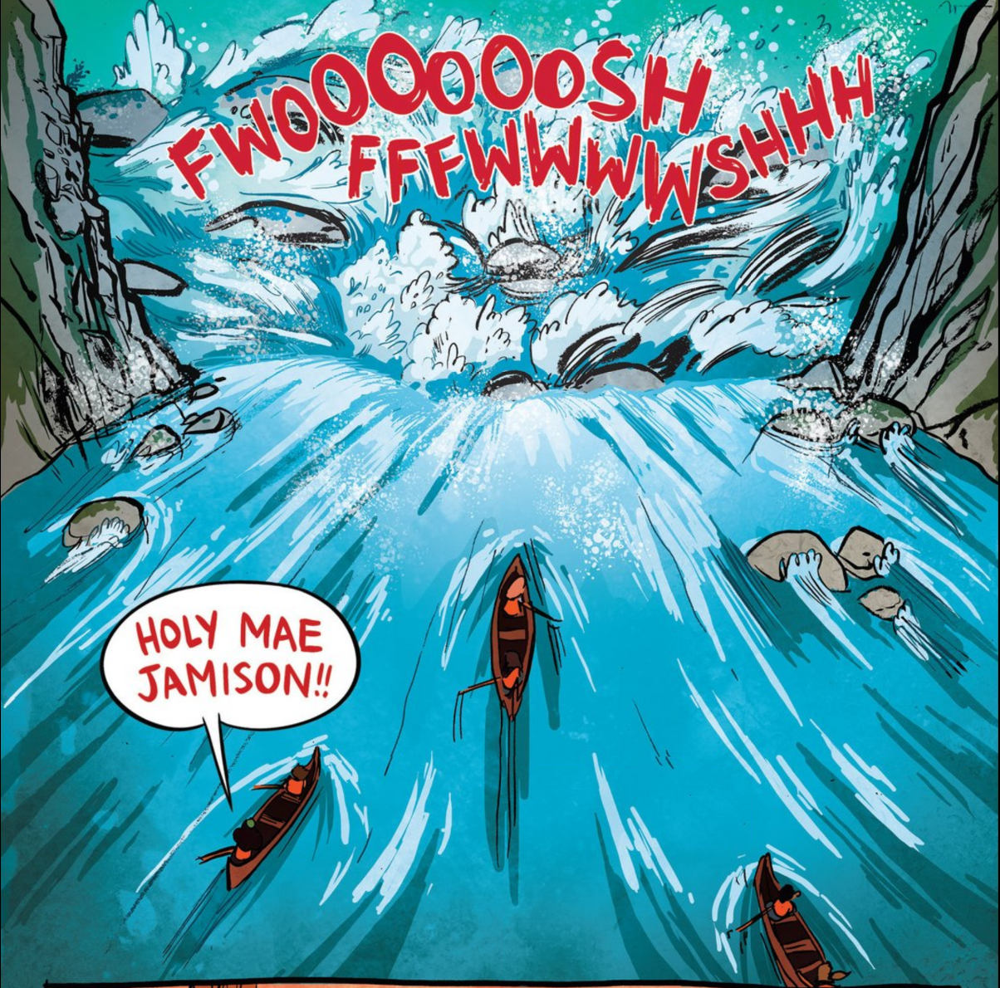
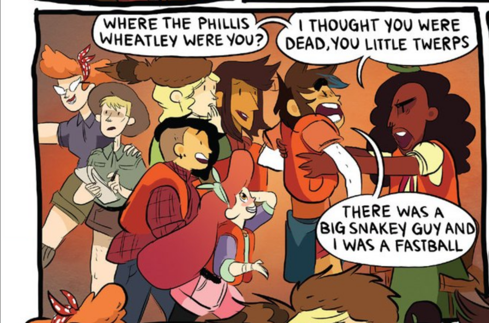
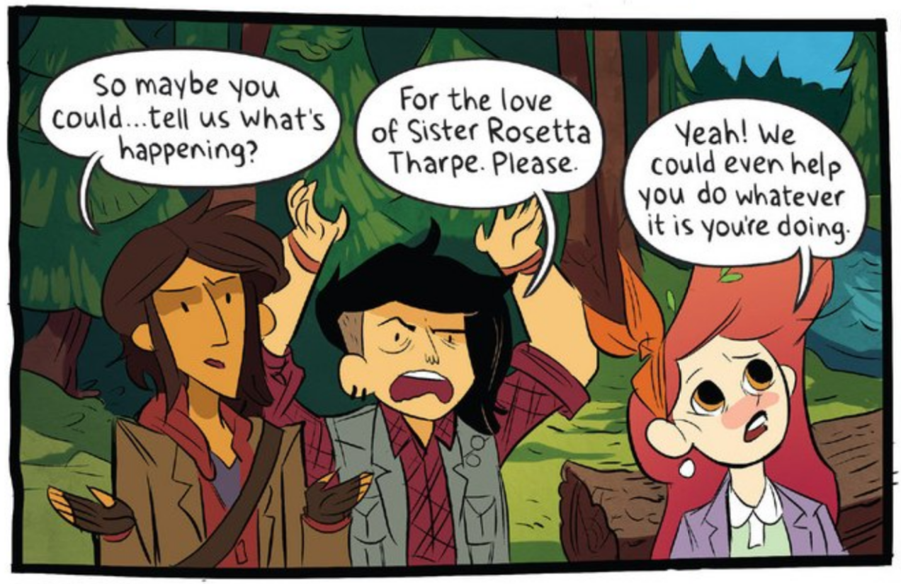

# Women invoked in Lumberjanes

Where some folks would blaspheme or curse, Lumberjanes invoke the names of notable women. Some I recognize, some I don't so I figured I'd read through this great comic again and pull out some names.

## Issue #1

#### Page 5 - Joan Jett

*Mal, Molly, what in the Joan Jett are you DOING?*

#### Page 12 - Bessie Coleman

*Oh my Bessie Coleman can we just worry about getting back to camp before Jen wakes up?!*

## Issue #2

#### Page 8 - Mae Jemison

*Holy Mae Jamison!*

## Issue #3

#### Page 23 - Phillis Wheatley

*Where the Phillis Wheatley were you? I thought you were dead, you little twerps.*

## Issue #4

#### Page 4 - Anahareo

*What the Anahareo is that?*

#### Page 7 - Juliette Gordon Low

*"How come" nothing! Good Juliette Gordon Low, we're allowed to have something good happen every once in a while.*

## Issue #5

#### Page 10 - bell hooks

*Holy bell hooks!*

## Issue #6

#### Page 3 - Agnodice

*Oh my Agnodice, this is the dumbest game I've ever played.*

#### Page 22 - Sister Rosetta Tharpe

*For the love of Sister Rosetta Tharpe. Please.*

